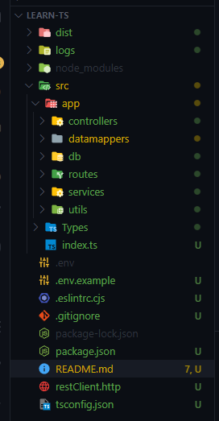

# Typescript & NodeJS

## Introduction

Technologies used for this short API (single router)

- NodeJS
- Express
- Database NoSQL MongoDB
- Typescript

Simple example of connection with database using Typescript.

## How to start

First of all, initialize the folder and install dependencies to use it

```sh
npm init -y
npm i -D @types/debug @types/express concurrently debug eslint
npm i dotenv express typescript
```

Without the @types/express and @types/express packages, there is no way for TypeScript to know about the types of Express and Debug classes.

## tsconfig.json file

Configure the `tsconfig.json` file

```sh
{
  "compilerOptions": {
    "module": "ES6",
    "esModuleInterop": true,
    "target": "es6",
    "moduleResolution": "node",
    "sourceMap": true,
    "outDir": "dist"
  },
  "lib": ["es2015"],
  "compileOnSave": true
}

```

I use ESM and i want to compile Typescript on save so add `compileOnSave` on true.

The `outDir` can specify where the file will be savec once compiled.

## Configure eslint

```sh
npm init @eslint/config
```

This will ask you a series of questions. For this project we’ll answer the following:

    How would you like to use ESLint? : To check syntax and find problems
    What type of modules does your project use? : JavaScript modules (import/export)
    Which framework does your project use? : None of these
    Does your project use TypeScript? : Yes
    Where does your code run? : Node
    What format do you want your config file to be in? : JavaScript
    Finally, you will be prompted to install some additioanl eslint libraries. Choose Yes.

## Configure you package.json

```js
{
  "type": "module",
  "name": "learn-ts",
  "version": "1.0.0",
  "description": "Learn TS",
  "main": "dist/index.js",
  "scripts": {
    "start:BUILD_🏰": "tsc -w",
    "start:RUN_🚀": "nodemon dist/index.js",
    "start:LINT_💥❓❗": "eslint . --ext .ts",
    "watch": "concurrently \"npm:start:*\" -c green.bold,yellow.bold,blue.bold"
  },
  "keywords": [
    "typescript"
  ],
  "author": "yumicode",
  "license": "MIT",
  "dependencies": {
    "dotenv": "^16.0.1",
    "express": "^4.18.1",
    "mongodb": "^4.9.0",
    "typescript": "^4.8.2"
  },
  "devDependencies": {
    "@types/debug": "^4.1.7",
    "@types/express": "^4.17.13",
    "@typescript-eslint/eslint-plugin": "^5.35.1",
    "@typescript-eslint/parser": "^5.35.1",
    "concurrently": "^7.3.0",
    "debug": "^4.3.4",
    "eslint": "^8.23.0"
  }
}

```

- Don't forget type "module"
- Add "concurrently" to launch compiler and your server

## Folder structure

Create a `src` folder and inside all of your folders

Here's mine



## Configure your entrypoint

Create you typescript index.ts file and import modules you need

```js
//~Dotenv
import 'dotenv/config';

//~Import modules
import express from 'express';
const app = express();
import { router } from './app/routes/index.js';
//! Be careful, when create import in TS file, import js file !!
import { ErrorApi } from './app/services/errorHandler.js';

//~Debug
import debug from 'debug';
const logger = debug('EntryPoint');

//~Router
app.use(router);

//~ Error 404 NOT Found
app.use((req, res) => {
  throw new ErrorApi(`Page Not Found !`, req, res, 404);
});

//~Launch server
const PORT = process.env.PORT ?? 3000;

app.listen(PORT, () => {
  logger(`🚀\x1b[1;35m Launch server on http://localhost:${PORT}\x1b[0m`);
});
```

## Configure routes

In this case, we juste use only one route to make it easy.
Create a new folder named 'routes' and create user.ts file (here, I just add an index.ts, thinking about the future)

```js
//~Import modules
import { Router } from 'express';
const router = Router();

import { fetchAllUsers } from '../controllers/userController.js';

//~Routes
router.get('/users', fetchAllUsers);

export { router };
```

## Connect the database

I use MongoDB for database, it's a NoSQL database, simple to use

```js
//~import module
import { MongoClient } from 'mongodb';
//~ Import Debug
import debug from 'debug';
const logger = debug('Pool');

//~connexion
const url = process.env.CONNEXION_STRING;
const client = new MongoClient(url);

client
  .connect()
  .then(() => logger('DB connected'))
  .catch((err) => logger('DB connection failed', err));

export default client;
```

## Query

In the coreDataMapper.ts file

```js
class CoreDataMapper {
  dbName =  'authme';
  collectionName: string; // define type
  [key: string]: any; //  when you don't know all property names

  constructor(client: object) {
    this.client = client;
  }

  async findAll() {
    const db = this.client.db(this.dbName);
    const collection = db.collection(this.collectionName);

    const result = await collection.find().toArray();

    return result;
  }
}

export { CoreDataMapper };
```
Extends coreDataMapper for the user :

```js
//~import module
import client from '../db/database.js';
import { CoreDataMapper } from './coreDataMapper.js';

class UserDataMapper extends CoreDataMapper {
  collectionName = 'user';
}

const User = new UserDataMapper(client);
export { User };
```

## Add fetchAllUsers functionnality

Create a new folder in `src` named `controllers` and add a new file userController.ts to create your function

```js
//~Import modules
import debug from 'debug';
const logger = debug('Controller');
import { User } from '../datamappers/index.js';
import { ErrorApi } from '../services/errorHandler.js';
import { Request, Response } from 'express';

//~CONTROLLERS
async function fetchAllUsers(req: Request, res: Response) {
  try {
    const users = await User.findAll();

    if (!users || users.length === 0) throw new ErrorApi(`No users found !`, req, res, 400);

    return res.status(200).json(users);
  } catch (err) {
    logger(err.message);
  }
}

export { fetchAllUsers };
```

## TYPES

## Testing


---

Sources

[TUTO](https://www.digitalocean.com/community/tutorials/setting-up-a-node-project-with-typescript)

[Compiler options](https://www.typescriptlang.org/docs/handbook/compiler-options.html)

[TS config](https://www.typescriptlang.org/tsconfig)
